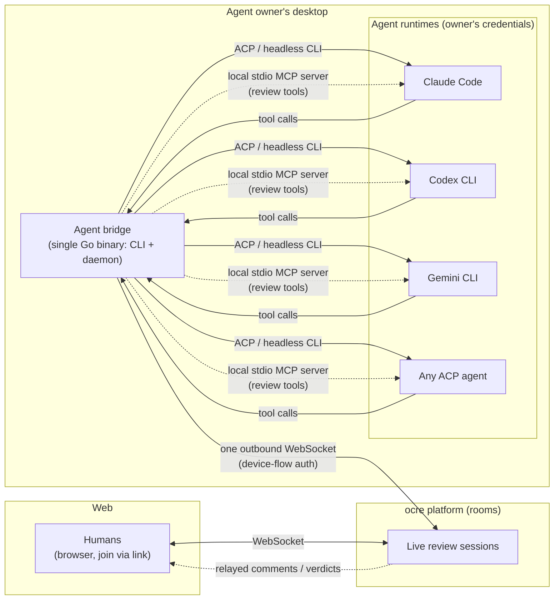

# Agent participation model

Answers the founder's question (2026-09-17): *how can we achieve a
best-case collaboration system while keeping user-designed and
user-designated agents as active participants — without ocre building or
hosting agents, without billing for AI tokens, and without a poor BYOK
experience?*

The evidence supports a specific architecture. **ocre builds none of the
hard parts; every component has a proven primary-source precedent.**

## The model in one paragraph

Humans join live review sessions in the browser via links (per the
[platform decision](/concepts/research/platform-tradeoffs.md)). An agent
owner runs a small **agent bridge** — a single-binary CLI/daemon on their
desktop — that authenticates to the ocre platform with the OAuth device
flow, holds **one long-lived outbound WebSocket** to the review rooms, and
appears as a live participant (presence, comments, replies, verdicts) just
like a human. When the session needs the agent's opinion, the bridge
invokes the owner's existing agent runtime locally (Claude Code, Codex
CLI, Gemini CLI, opencode, or any ACP-speaking agent) **using the owner's
own subscription credentials**, hands it the review context plus a local
MCP server exposing review actions (read diff, comment on line/block/file,
reply, approve, request changes, reference another PR), and relays the
agent's tool calls back onto the shared surface. ocre never sees an API
key, never runs a model, and bills nothing for tokens.

## Why each piece is precedented (not novel risk)

### 1. Outbound-only connection: the Socket Mode / Discord Gateway pattern

Slack Socket Mode lets an app receive events over an **outbound WebSocket**
instead of a public HTTP endpoint — the URL is minted at runtime via
`apps.connections.open` with an app-level token, connections refresh every
few hours, and each envelope is acked by id; the connection is
pre-authenticated, so no request-signature validation is
needed.[^slack-socket-mode] Discord's Gateway is the same shape: outbound
WSS, identify/heartbeat/resume, zero inbound endpoints, REST for
writes.[^discord-gateway] Both were built precisely so **processes on
private machines can be full platform participants** — Slack's own
framing is developers "behind a corporate firewall".[^slack-socket-mode]

This kills the hardest deployment problem in the BYO-agent precedent:
PR-Agent self-hosted proves users will run AI reviewers on their own
compute with their own LLM keys, but it needs a publicly reachable webhook
(or a tunnel hack) because it is request-triggered.[^pr-agent-selfhost] The
bridge is not request-triggered — it **connects out once and stays
connected**, so a laptop behind NAT/firewall is a first-class participant.
Liveblocks' 2026 agent APIs (presence, JSON-Patch storage writes, activity
feeds) prove "agents as first-class room collaborators" is a recognized
platform need — but theirs are server-side REST endpoints with a secret
key, meaning the agent is expected to run behind some server. **No
platform was found whose agents connect from the user's desktop over the
same live channel as humans. That gap is ocre's.[^liveblocks-agents]**

### 2. Driving the owner's agent runtime: headless modes with subscription auth

Every major runtime is already drivable by an external process, and — the
BYOK-UX-critical fact — **all of them default to the user's existing
subscription login**:

| Runtime | Programmatic surface | Auth for the bridge |
|---|---|---|
| Claude Code | `claude -p` headless (JSON/JSONL, `--json-schema` caller-supplied schema, `--allowedTools`) or Agent SDK[^claude-headless] | Subscription OAuth by default; `claude setup-token` for browserless; **`--bare` mode ignores subscription — avoid it**; stray `ANTHROPIC_API_KEY` silently overrides the subscription[^claude-auth] |
| Codex CLI | `codex exec` (JSONL events, `--output-schema`, session resume, read-only sandbox default) or the app-server SDK[^codex-exec] | "Reuses saved CLI authentication by default" — ChatGPT plan login; `--with-access-token` for non-interactive enterprise[^codex-auth] |
| Gemini CLI | `gemini -p` headless or **native ACP** (`gemini --acp`, JSON-RPC over stdio; client can register its own MCP server at initialize)[^gemini-acp] | Google OAuth cached locally works interactively; docs recommend API key/Vertex for headless — the one asymmetry (open question below) |
| opencode | `opencode serve` (full HTTP/OpenAPI server: sessions, messages, permissions) or `opencode acp`[^opencode-server] | BYO provider keys (opencode is itself BYOK at the model layer) |
| Any ACP agent | JSON-RPC over stdio, stable v1; Claude Code and Codex via official adapters; Copilot CLI in preview; 40+ agents listed[^acp-agents] | Whatever the agent already uses |

ACP matters most: the protocol's own clients directory lists **non-editor
bridges as an established client category** — mobile apps driving agents,
scheduled-task bridges, chat connectors, HTTP gateways.[^acp-clients] A
code-review bridge is a precedented ACP client type, not a novel use.

### 3. Giving agents review actions: a local MCP server (surface-as-tools)

Per the MCP 2025-06-18 spec there are exactly two transports: stdio (client
launches the server as a subprocess; no OAuth machinery — "retrieve
credentials from the environment") and Streamable HTTP (OAuth 2.1
resource server).[^mcp-transports] Exposing a product's actions as MCP
tools is the standard integration shape: GitHub's official MCP server
surfaces issues/PRs/reviews as tools;[^github-mcp] Linear's exposes
issues/projects/comments with a scoped read-only endpoint.[^linear-mcp]

So the bridge hosts a **local stdio MCP server** whose tools are the review
model's verbs: `list_reviews`, `read_diff`, `post_comment` (line / block /
file / directed-at), `reply`, `approve`, `request_changes`,
`reference_pr`. The agent discovers and calls them like any MCP tool; the
bridge relays calls onto the room's action API. Gemini's ACP mode even
defines the client registering its MCP server during the initialize
handshake[^gemini-acp] — the composition is anticipated by the specs.

This keeps ocre's noise controls (severity gating, single-summary-first,
per-team learned filters — see
[AI review noise](/concepts/research/ai-review-noise.md)) **enforceable at
the room boundary** where actions are executed, regardless of which agent
produced them: the platform owns volume policy; the agent owner owns the
model.

### 4. Authenticating the bridge: RFC 8628 device flow

The device authorization grant exists for exactly this case: the client
needs only outbound HTTPS, displays a code, the user approves in a browser,
and the CLI polls for its token — no inbound listener, no pasting tokens
into terminals.[^rfc8628] `gh auth login` and the Slack CLI are the
familiar dev-tool instances of the shape. The bridge uses device flow once;
tokens refresh thereafter.

### 5. BYOK UX: the market already picked the answer

The criticized UX in this space is **API-key-paste** — Cursor (the
highest-profile BYOK product) restricted then killed BYOK amid backlash,
and its agent features never worked with API keys at all; commentators
describe key-paste as "a conversion tax".[^cursor-byok] The good UX is
**"reuse the subscription you already pay for"**, which is exactly what
Claude Code, Codex, and Gemini CLI made their default logins[^claude-auth][^codex-auth]
— and why Claude's own docs warn about the stray env var that silently
bills API rates instead. ocre inherits this for free: the bridge shells out
to runtimes the user is already logged into. **The user experience of
connecting an agent is: install one binary, run `ocre agent connect`,
approve in the browser, pick your runtime. No keys ever.**

## Shell decision: single Go binary, no GUI shell

The bridge needs no window. The precedented minimum shape is a
**daemon/CLI-first single binary**:

* watchman (Meta): per-user daemon, zero GUI, client+server in one binary,
  pervasive since 2012.[^watchman] Docker: standalone `dockerd`, CLI as
  thin client, Desktop GUI an optional add-on. Slack CLI and GitHub CLI:
  plain Go binaries in brew/scoop/winget.
* Pure Go cross-compiles free (`CGO_ENABLED=0`, static single binary per
  OS/arch); `coder/websocket` is the maintained, Go-Author-recommended
  websocket client[^coder-websocket]; `minio/selfupdate` handles atomic
  self-update with checksums[^minio-selfupdate]; GoReleaser automates
  per-platform artifacts.
* The bridge very likely does **not** need a CRDT: it needs the room's
  event stream plus an action API. If CRDT peerage is ever required, Go
  options exist (reearth/ygo is binary-compatible with yjs@13.x — young,
  needs evaluation; yrs in Rust is mature). A server-side event/REST layer
  over the room state is the simpler contract and matches the
  Socket-Mode-style "WS in, REST out" split Discord
  uses.[^discord-gateway]
* **The signing tax is stack-independent**: macOS Developer ID +
  notarization (hardened runtime; embedded helpers must be signed) and
  Windows signing (Azure Trusted Signing ~$9.99/mo or OV cert
  ~$150–300/yr; SmartScreen reputation accrues with volume) apply equally
  to a bare CLI and to any GUI shell[^apple-notarize][^ms-signing] — so
  they do not argue for adding a GUI.

If a human-facing desktop app is ever wanted later: **Wails** (Go + OS
webview; v2 stable with structural limits — single window, mandatory
window, no headless mode — which v3 (beta since 2026-08-02, desktop API
stable) exists to fix[^wails-v3-beta][^wails-roadmap]) fits a Go house
directly; **Tauri v2** (stable since Oct 2024) can ship the Go binary as
a sidecar via externalBin[^tauri-sidecar]; **Electron** buys mature
auto-update and rendering consistency at ~150–200MB and is what the big
dev tools still pick. All three preserve the wrap-later path the platform
research already favors; none is needed for v1 of the bridge.

## What this model buys (mapped to the founder's constraints)

| Constraint | How the model satisfies it |
|---|---|
| No building/hosting agents | ocre builds a bridge (thin relay + MCP server), never an agent; runtimes stay on the user's machine |
| No token billing | Model calls happen inside the owner's runtime on their subscription; ocre's server only carries review payloads (tiny JSON), never model I/O |
| Agents on desktop = advantage | Exactly where they run; local git access, local repo state, no egress of source beyond what review requires |
| BYOK must not hurt UX | Device-flow connect + "use the runtime you're already logged into"; the key-paste antipattern is never presented |
| Agents as true participants | Same room protocol, presence, directed comments, replies — not webhook bots (the Liveblocks/desktop gap[^liveblocks-agents]) |
| Platform retains noise governance | Volume policy enforced at the action boundary: severity gates, rate limits per agent token (Discord-style buckets[^discord-gateway]), verification tiers |

## Open questions

1. **Gemini headless auth asymmetry**: Google's docs recommend API key /
   Vertex for headless mode; whether cached Google-account OAuth works
   reliably for long-running unattended `gemini -p` is unverified. If not,
   Gemini-agent owners fall back to API keys — the one place key-paste
   could reappear. Needs a hands-on test.
2. **ToS for subscription reuse via a third-party bridge**: relaying
   prompts through the user's own Claude Code/Codex session is what every
   wrapper tool does, but Anthropic/OpenAI terms for *automated* driving
   of consumer subscriptions need a read before betting the product on
   it. `claude setup-token`'s "model requests only" scope suggests
   Anthropic anticipated non-browser uses; legal review still required.
3. **Persistent sessions vs subprocess-per-task**: `claude -p` /
   `codex exec` are subprocess-per-task; the SDKs/app-server support
   persistent sessions. Which shape gives snappier interactive review
   (and how subscription-OAuth refresh behaves in a long-lived daemon)
   needs prototyping.
4. **ygo maturity** if Go CRDT peerage is ever needed; the simpler path
   is the server-side event API, which also keeps the bridge
   protocol-thin.
5. **Agent identity/pacing on the shared surface** — per-agent rate
   buckets, unverified-vs-verified agent tiers, and how presence renders
   for agents (carried from the vision doc, now with Discord/Slack
   precedent for the control levers[^discord-gateway][^slack-socket-mode]).
6. **Room protocol choice for the bridge**: plain JSON events + action
   API (recommended) vs CRDT updates — decided when the web platform's
   room layer is designed.

## Verification

Re-read against primary sources on 2026-09-17: Slack Socket Mode docs
(verbatim — outbound WSS, runtime-minted URL, envelope acks, 10-connection
cap, refresh cycle), Claude Code headless docs (verbatim — `-p`, JSON
schema enforcement, `--bare` subscription caveat), MCP 2025-06-18
transports spec (verbatim — two transports, stdio semantics), ACP agents
list (verbatim — 40+ agents, adapter status per agent). Codex, Gemini,
opencode, PartyKit, Liveblocks, Matrix, Wails, Tauri, signing, and
library items: research-pass reads from primary docs/repos with caveats
noted inline; the Cursor BYOK narrative is secondary-source (flagged).

[^slack-socket-mode]: Slack developer docs (primary, verified by direct read).
[^discord-gateway]: Discord developer docs (primary).
[^rfc8628]: IETF Standards Track RFC (primary).
[^claude-headless]: Claude Code official docs (primary, verified by direct read).
[^claude-auth]: Claude Code official docs (primary).
[^codex-exec]: Codex CLI official docs (primary).
[^codex-auth]: Codex CLI official docs (primary).
[^gemini-acp]: Gemini CLI official repo docs (primary).
[^opencode-server]: opencode official docs (primary).
[^acp-agents]: ACP official site (primary, verified by direct read).
[^acp-clients]: ACP official site (primary).
[^mcp-transports]: MCP specification 2025-06-18 (primary, verified by direct read).
[^github-mcp]: GitHub official MCP server repo (primary).
[^linear-mcp]: Linear official docs (primary).
[^pr-agent-selfhost]: PR-Agent official installation docs (primary).
[^liveblocks-agents]: Liveblocks official blog (primary, vendor bias).
[^matrix-cs-api]: Matrix specification (primary).
[^partysocket]: PartyKit official docs (primary).
[^y-websocket]: y-websocket repo (primary).
[^wails-v3-beta]: Wails official blog (primary).
[^wails-roadmap]: Wails official blog (primary).
[^tauri-sidecar]: Tauri v2 official docs (primary).
[^coder-websocket]: coder/websocket repo (primary).
[^minio-selfupdate]: minio/selfupdate repo (primary).
[^apple-notarize]: Apple developer docs (primary).
[^ms-signing]: Microsoft Learn (primary).
[^watchman]: Meta watchman official docs (primary).
[^cursor-byok]: Scribelet blog (secondary — BYOK-UX negative case; flagged).