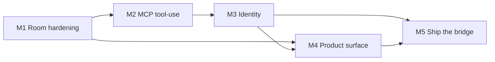

# Build phase — from spike to v1

The research phase is closed. This plan turns the verified
[core-loop spike](/concepts/design/core-loop-spike.md) into ocre v1. The
spike proved the loop end-to-end: share-link join, live presence, inline
comments, human→agent mention, real `claude -p` review, governance
enforced at the action boundary, MCP stdio surface. Every milestone
below starts from something the spike already showed, and removes one
known limitation.

## Founder rulings that opened the build phase (2026-09-17)

1. **ToS risk is accepted.** The founder read the
   [ToS clauses](/references/research/subscription-tos-clauses.md) and is
   comfortable building on subscription-auth driving. If a clause becomes
   a real concern, the agent interface can move to ACP-only. That is a
   later decision; it does not block the build.
2. **Traversable does not matter.** Dropped from the open-question
   list.
3. **Storage is server-side for v1.** Durable server-held review state;
   local-first and federated storage stay recorded as escape hatches per
   the [platform decision](/decisions/platform-architecture.md).

## Scope of v1

The core loop, production-grade: create a review from a git change-set,
share it, humans and agent(s) review it live together, the record
survives. Explicitly **out of scope**: merge-gate semantics, forge
write-back (comments land only in ocre), cross-room reputation,
multi-room concurrent sessions, pricing.

## Milestones

The order is by dependency, not by value. Each milestone states the
spike limitation it removes.

### M1 — Room hardening (persistence, reconnect, anchors)

*Removes:* rooms are in-memory; reconnect loses events; commit-sha
anchor stability is untested.

* **Migrate the room layer from `spike/` into a first-class module.**
  The spike stays runnable as the reference. Extract roomd's core into
  `internal/room` in the repo root Go module (name `ocre`), and keep the
  web client as an embedded asset.
* **Durable room state.** Store comments, verdicts, and presence
  history server-side (SQLite for v1). A `roomd` restart must not lose
  review state.
* **Reconnect replay.** On reconnect, the client receives every event
  it missed since its last acknowledged id, then the live stream
  resumes (Discord Gateway resume precedent).
* **Anchor stability.** When the change-set re-pushes, map anchors
  forward or mark the comment outdated — never mutate the original
  anchor (comment-model invariant 1). Add a test that comments survive
  a force-push of the underlying branch.

**Acceptance:** kill the server mid-review, restart, and the review
reopens with all comments and verdicts. Force-push the branch and
anchored comments re-locate or mark outdated, not break.

### M2 — MCP tool-use loop (the agent posts its own findings)

*Removes:* the bridge drives the runtime by prompt and posts findings
on the agent's behalf; the agent does not call the tools.

* **Wire `--mcp-config`.** The bridge launches the runtime with its
  stdio MCP server registered. The agent reads the diff and posts
  comments, replies, and verdicts through the tools itself. The
  bridge's parse-and-post fallback stays for runtimes without MCP
  support.
* **Full verb surface.** Implement the remaining comment-model verbs:
  `list_reviews`, `resolve_comment`, `reference`. Verify the full tool
  list in `tools/list`.
* **Governed tool calls.** All constraints from
  [agent governance](/concepts/design/agent-governance.md) still
  enforce at the action boundary; verify the MCP path hits the same
  checks (severity required, advisory verdicts, rate buckets).
* **Second runtime.** Verify the same loop with `codex exec`. Gemini
  stays open (workstation has no gemini CLI); test when available.

**Acceptance:** mention the agent from the web UI; the agent calls
`read_diff`, `post_comment` with severity, and `request_changes` via
MCP tool calls observed in the transcript; the UI updates live; a
governance violation still returns 429/400 through the MCP path.

### M3 — Identity (device flow, human accounts, per-owner agents)

*Removes:* query-token stand-ins; one shared agent identity.

* **OAuth device flow for the bridge** (RFC 8628): `ocre agent
  connect` prints a code, the owner approves in the browser, the bridge
  receives a token and refreshes it. No key paste, ever.
* **Human accounts.** Review creators and human participants log in
  (web OAuth). v1 identity provider: magic-link email or GitHub — one
  provider, not both.
* **Per-owner agents.** Each bridge connection registers an agent
  actor owned by the connecting human (`owner_id`). Two owners can run
  agents in one room with distinct identities and distinct rate
  buckets.
* **Anchor the anchor test.** Re-run the M1 force-push test with the
  room served by the authenticated path.

**Acceptance:** a second bridge on another machine joins the same room
with its own agent identity; rate limits apply per agent; the human
login flow works end-to-end in the browser; the agent's owner is
visible in the UI.

### M4 — Product surface (reviews from real change-sets)

*Removes:* the spike's demo review is hand-loaded; real review objects
do not exist.

* **Real change-sets.** Create a review from a git diff (local file,
  patch upload, or PR URL — pick one input for v1). Render the diff,
  not the demo HTML.
* **Review lifecycle.** A review has open/merged/abandoned states.
  Verdicts move a review toward completion; advisory agent verdicts
  never close one (governance constraint 1).
* **Digest rendering.** Medium/low agent comments collapse into a
  digest by default; high severity shows inline (governance constraint
  2).
* **Reactions.** 👍/👎 on comments, stored as comment-model facets —
  the signal source for the learning loop (governance constraint 5).
  The reaction model is the one comment-model design item to finish in
  this milestone.

**Acceptance:** create a review from a real patch or PR, share the
link; two humans and one agent complete a review with severity
rendering, digest collapse, reactions, and a final verdict; the review
reaches a terminal state and stays retrievable.

### M5 — Ship the bridge (distribution, hardening)

*Removes:* the bridge exists only as a dev-run binary; nothing ships.

* **Single-binary build.** GoReleaser config for macOS (arm64) and
  Linux; signed + notarized macOS build. Windows is deferred with the
  platform decision's signing-tax note.
* **Self-update.** `minio/selfupdate` with checksum verification; the
  bridge checks for updates on connect.
* **Hardening pass.** Env sanitization defaults on (spike finding);
  reconnect backoff with jitter; WS auth token rotation; audit log of
  agent actions per room.
* **Docs.** Install and connect guide: `brew install` (or curl |
  sh), `ocre agent connect`, approve in browser, pick runtime. The
  no-keys-ever UX promised in the
  [agent participation model](/concepts/research/agent-participation.md).

**Acceptance:** a machine that is not the dev workstation installs the
bridge, connects via device flow, joins a review, and completes an
agent review with zero manual configuration.

## Dependency edges

M1 blocks M2 and M4: the MCP loop and the product surface both assume
state that survives restart and reconnect. M3 needs M2's wired runtime
loop to be worth authenticating. M5 ships only what M3 and M4 made
real.

## What this plan does not schedule

* **Formal legal review** — no longer a gate; risk accepted by the
  founder. The ACP-only fallback stays a recorded design option if a
  ToS concern becomes real.
* **Gemini CLI** — test when a workstation has it; do not block any
  milestone on it.
* **Enterprise/audit requirements** — unknown; revisit when a customer
  asks (server-side v1 storage already covers the common case).
* **Cursors/live presence beyond join/leave** — post-v1 polish.

## Success criterion for the phase

A real review with real stakes: a team shares a link, humans and
agents review a live PR together, governance keeps agent noise
controlled, the record persists, and no participant needed a key, an
account on a third-party service, or a manual step.

[^spike-report]: ocre KB, core-loop spike report.
[^platform-decision]: ocre KB, platform architecture decision.
[^comment-model]: ocre KB, comment model.
[^agent-governance]: ocre KB, agent governance constraints.
[^tos-clauses]: ocre KB, subscription ToS clauses.
